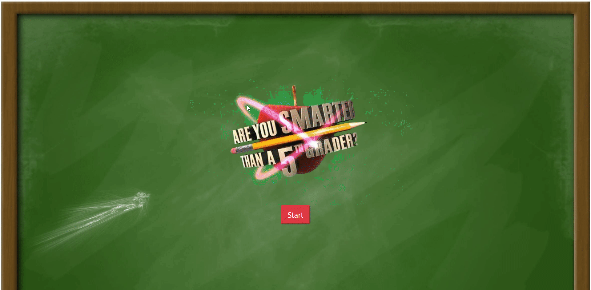
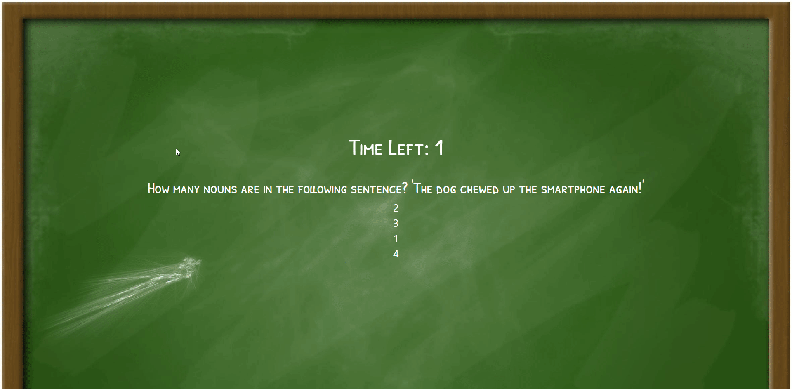
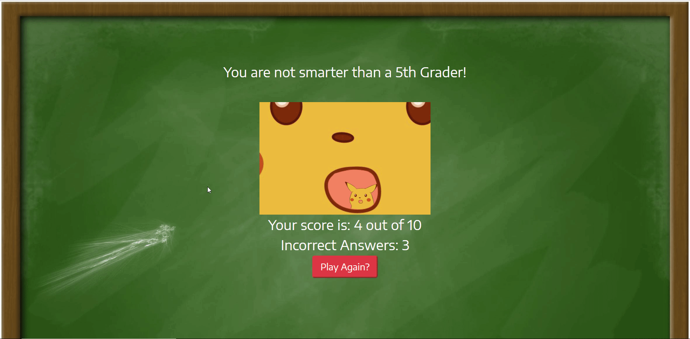

# Trivia-Game

[Playable Link](https://phillipchang.github.io/Trivia-Game/)

### Main-Screen

### Time Expire

### Result Screen

## Description

Are you smarter than a 5th grader? Test your true knowledge in this trivia game. Questions range from science, math, geography and common sense. 

Instructions: 

1. Click "Start" button to commence the game.
2. You have 30 seconds to answer each question.
3. The timer does not start until you see the question and each unanswered question will be marked incorrect.

# Technologies Used

* HTML
* CSS
* Bootstrap
* Javascript
* jQuery

# Author

Phillip Chang

